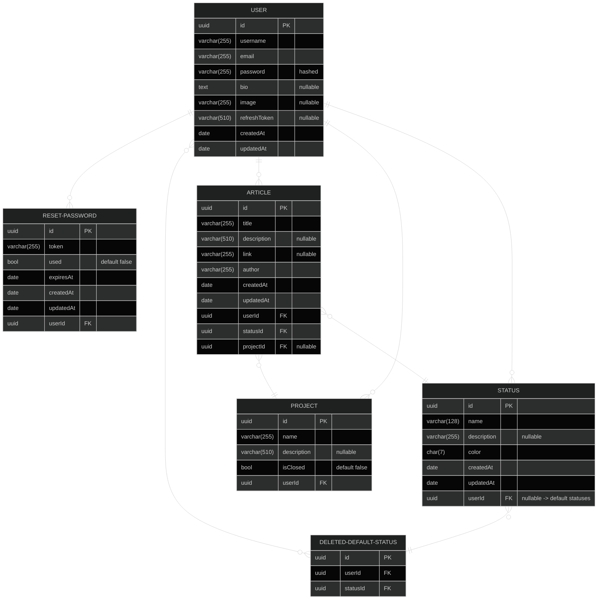

# Entity Relationship Diagram

```mermaid
erDiagram
%%{init: {'theme':'dark'}}%%

    USER {
        uuid id PK
        varchar(255) username
        varchar(255) email
        varchar(255) password "hashed"
        text bio "nullable"
        varchar(255) image "nullable"
        varchar(510) refreshToken "nullable"
        date createdAt
        date updatedAt
    }

    RESET-PASSWORD {
        uuid id PK
        varchar(255) token
        bool used "default false"
        date expiresAt
        date createdAt
        date updatedAt

        uuid userId FK
    }

    ARTICLE {
        uuid id PK
        varchar(255) title
        varchar(510) description "nullable"
        varchar(255) link "nullable"
        varchar(255) author
        date createdAt
        date updatedAt

        uuid userId FK
        uuid statusId FK
        uuid projectId FK "nullable"
    }

    STATUS {
        uuid id PK
        varchar(128) name
        varchar(255) description "nullable"
        char(7) color
        date createdAt
        date updatedAt

        uuid userId FK "nullable -> default statuses"
    }

    DELETED-DEFAULT-STATUS {
        uuid id PK

        uuid userId FK
        uuid statusId FK
    }

    PROJECT {
        uuid id PK
        varchar(255) name
        varchar(510) description "nullable"
        bool isClosed "default false"

        uuid userId FK     
    }

    
    ARTICLE 0+ to 1 STATUS : ""
    ARTICLE 0+ to 1 PROJECT : ""

    USER 0+ to 0+ DELETED-DEFAULT-STATUS : ""
    USER 1 to 0+ ARTICLE : ""
    USER 1 to 0+ STATUS : ""
    USER 1 to 0+ PROJECT : ""
    USER 1 to 0+ RESET-PASSWORD : ""

    STATUS 0+ to 1 DELETED-DEFAULT-STATUS : ""
    
```
